<p align="center">
  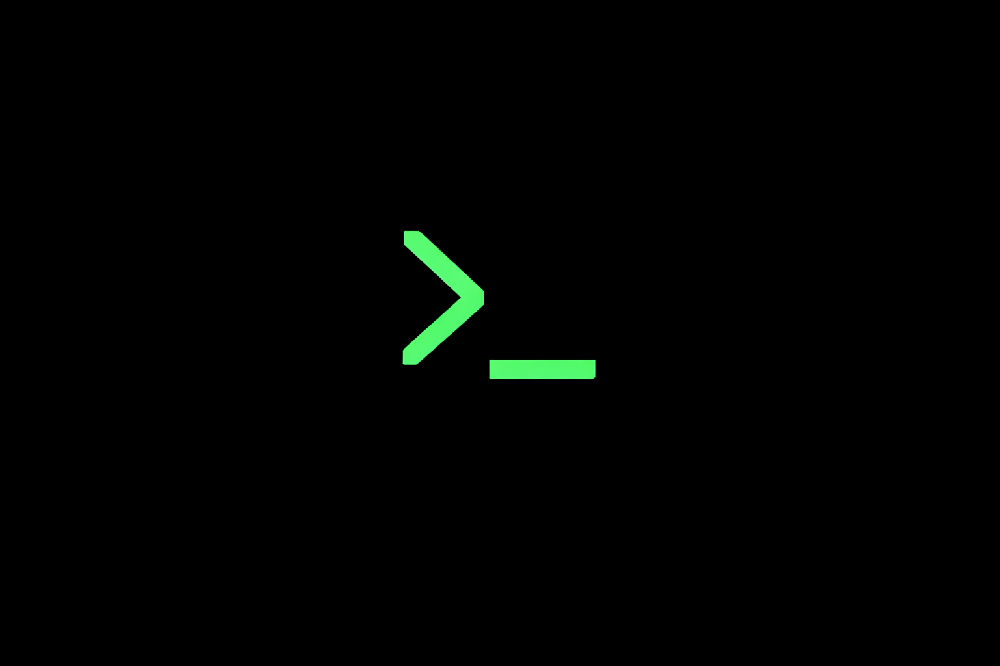
</p>

<h1 align="center">hackr.gg</h1>

<p align="center">
  <strong>Describe. Build. Execute.</strong>
</p>

<p align="center">
  <em>The visual workflow builder that transforms how security professionals conduct reconnaissance.</em>
</p>

<p align="center">
  <a href="https://hackr.gg">Live Platform</a> •
  <a href="#-getting-started">Get Started</a> •
  <a href="#-features">Features</a> •
  <a href="#-desktop-agent">Desktop Agent</a> •
  <a href="#-tool-library">Tools</a>
</p>

---

## 🎯 What is hackr.gg?

**hackr.gg** is a next-generation security reconnaissance platform that lets you build, execute, and manage complex security tool chains through an intuitive visual interface. Instead of memorizing CLI commands and manually piping outputs between tools, you simply drag, drop, and connect—or just describe what you want in plain English and let AI generate the workflow for you.

Whether you're a seasoned penetration tester automating your recon methodology or a security researcher exploring attack surfaces, hackr.gg eliminates the friction between idea and execution.

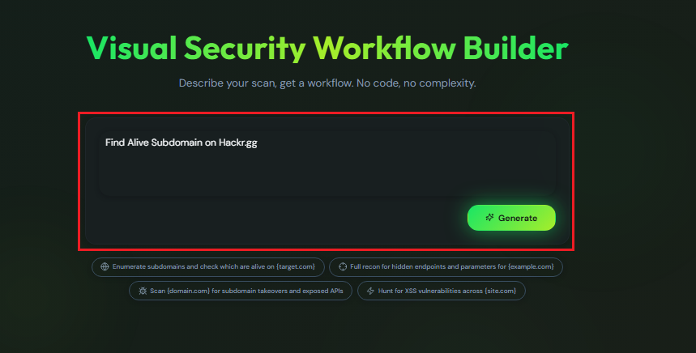

*Just describe what you want: "Find all subdomains for example.com and check which ones are alive" — and hackr.gg builds the workflow for you.*

---

## ✨ Why hackr.gg?

### 🚀 **From Concept to Execution in Seconds**
Stop spending time writing bash scripts and remembering flags. Describe your reconnaissance goal in natural language, and our AI instantly generates an optimized tool chain. Or build it yourself with drag-and-drop simplicity.

### 🔗 **Visual Tool Chaining**
See exactly how your tools connect. The visual canvas shows the flow from subdomain enumeration → HTTP probing → vulnerability scanning, with automatic validation ensuring your chain will actually work before you run it.

### ⚡ **Real-Time Everything**
Watch your scans execute live with streaming terminal output. No more waiting for a script to finish to see what's happening. Every discovery streams to your screen the moment it happens.

### 🏠 **Your Machine, Your Tools**
Unlike cloud-only solutions, hackr.gg executes tools on YOUR machine through our lightweight desktop agent. Your targets never touch our servers. Your results stay with you.

---

## 🖼️ Features

### AI-Powered Workflow Generation

The heart of hackr.gg is its intelligent workflow generator. Simply type what you want to accomplish—like "enumerate subdomains, probe for live hosts, and scan for vulnerabilities"—and the AI builds an optimized tool chain instantly.

The interface provides suggested prompts to get you started, but the real power is in natural language. Describe complex reconnaissance scenarios and watch them transform into executable workflows.


---

### Visual Drag-and-Drop Canvas

The workflow builder provides a full drag-and-drop canvas where you can manually construct and customize your tool chains. Each tool appears as a card that you can position, configure, and connect to others.

The canvas validates connections in real-time—you'll immediately know if you're trying to pipe incompatible outputs. Quick-fix suggestions appear when there's an issue, helping you build valid chains faster.

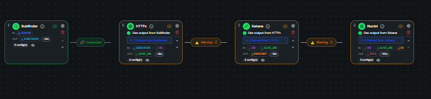

---

### Smart Tool Suggestions

As you build your workflow, hackr.gg learns the context and suggests logical next steps. After adding HTTPx, it might suggest Nuclei for vulnerability scanning or Katana for crawling. These aren't random—they're based on real reconnaissance methodologies.

The suggestions panel appears non-intrusively, offering one-click additions to your current chain. It understands tool compatibility, so every suggestion is guaranteed to work with your existing flow.

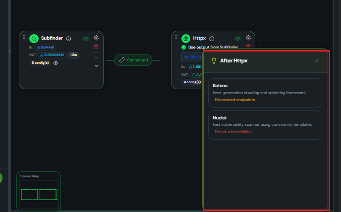

---

### Comprehensive Tool Library

Access a curated collection of industry-standard security tools, organized by category: Reconnaissance, Vulnerability Scanning, Web Crawling, Port Scanning, and more. Each tool card shows what it does, what inputs it accepts, and what outputs it produces.

The library includes tools like **Subfinder** for subdomain enumeration, **HTTPx** for HTTP probing, **Nuclei** for vulnerability scanning, **Katana** for web crawling, **Naabu** for port scanning, **Dalfox** for XSS detection, and **Gitleaks** for secret scanning.

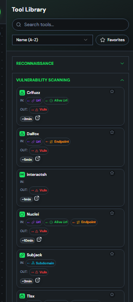

---

### Granular Tool Configuration

Every tool can be configured to your exact specifications. The configuration dialog exposes all the flags and options you'd use on the command line, but in a friendly interface with descriptions, defaults, and validation.

Choose your data sources (like CRTSH, Certspotter, or Shodan for Subfinder), set output formats, define rate limits, and configure any advanced options. The generated command preview shows exactly what will execute.

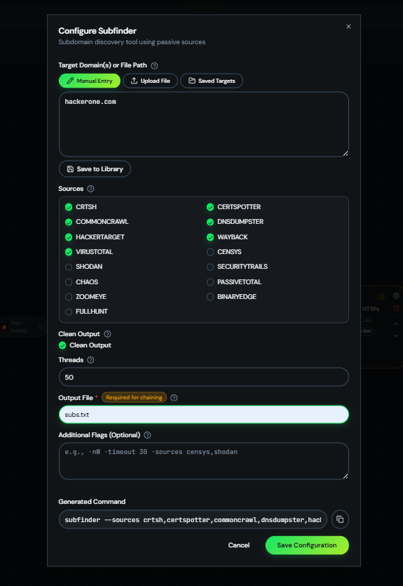

---

### Command Preview & Verification

Before any scan executes, you see the exact commands that will run. This transparency ensures you always know what's happening on your machine. The preview shows the full command chain, including how outputs pipe between tools.

A legal acknowledgment step confirms you have authorization to scan your targets—because responsible security testing matters.

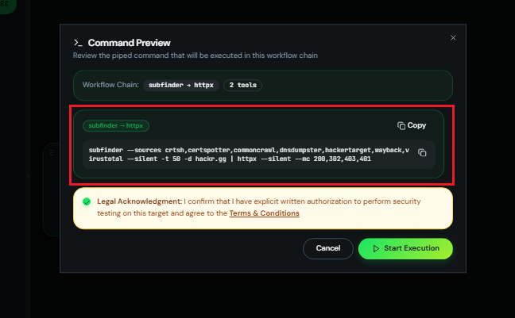

---

### Pre-Built Template Library

Don't want to build from scratch? Choose from a library of pre-built workflow templates designed for common reconnaissance scenarios. Templates range from simple subdomain enumeration to comprehensive attack surface mapping.

Each template is a starting point—import it, customize the configuration for your target, and execute. Perfect for standardizing your methodology or onboarding team members.

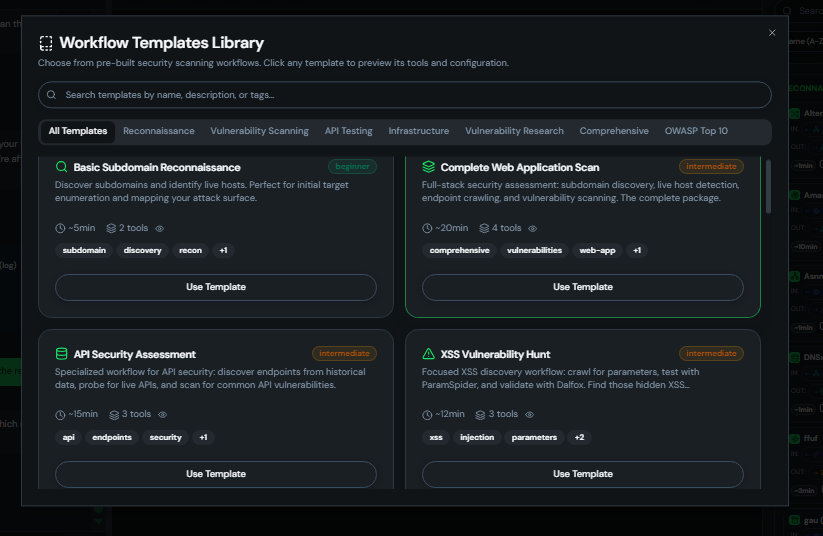

---

### Live Execution & Streaming Output

When your workflow runs, you see everything in real-time. The terminal panel streams output as tools execute, showing discoveries the moment they happen. A scanning banner indicates progress, and you can track each tool's status.

This isn't a black box—you watch your recon unfold live, just like running tools directly, but with the organization and persistence of a professional platform.

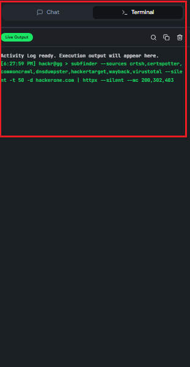

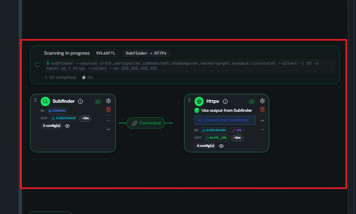

---

### Organized Workspaces

Keep your projects organized with workspaces. Each workspace is a container for related scans—maybe one per client, per bug bounty program, or per target organization.

The home page shows all your workspaces at a glance, with timestamps and quick access. Click into a workspace to see all its sessions, results, and saved configurations.

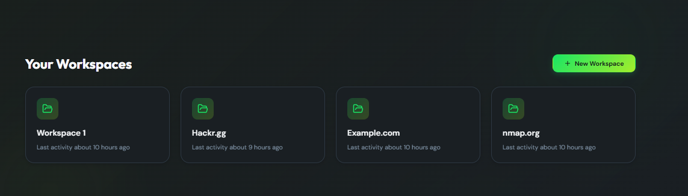

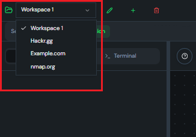

---

### Multi-Session Management

Run multiple scans simultaneously with session tabs. Each session is independent—different targets, different tool chains, different stages of execution. Switch between them instantly without losing state.

Sessions persist automatically, so you can close your browser and return later to find everything exactly as you left it.


---

### Save & Load Presets

Built a perfect workflow configuration? Save it as a preset. Name it, describe it, and reload it anytime with one click. Presets capture your entire tool chain with all configurations.

This is perfect for standardizing your methodology. Create presets for "Quick Subdomain Enum," "Full Web Recon," or "Pre-Engagement Surface Scan" and deploy them instantly on new targets.

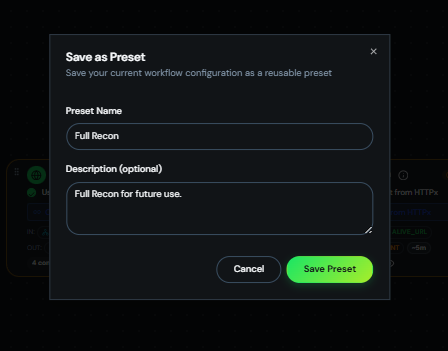

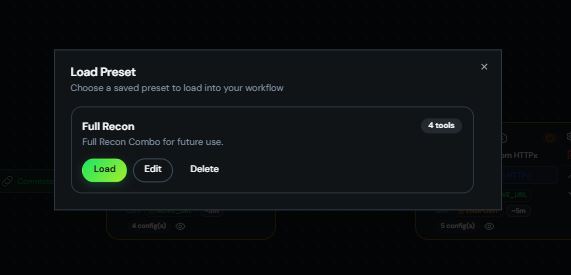

---

### Saved Targets Library

Stop re-typing target lists. The saved targets library lets you store and organize your target collections. Upload bulk lists, categorize by program or engagement, and load them into any workflow with one click.

Each target list shows count and type (domains, IPs, URLs), making it easy to manage large-scale reconnaissance across multiple engagements.

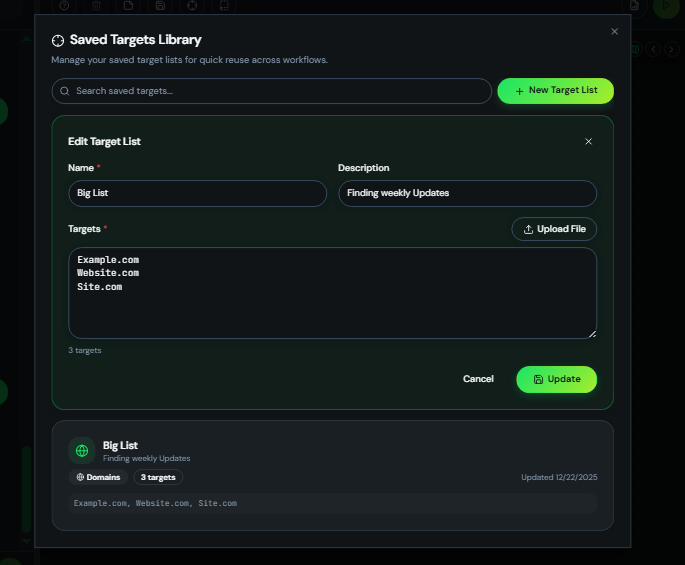

---

### Structured Execution Reports

After every scan, hackr.gg generates structured reports aggregating results from all tools in your chain. View findings by tool, severity, or category. Download results for offline analysis or integration with other tools.

The report viewer parses tool outputs intelligently—Nuclei vulnerabilities are categorized by severity, Subfinder results are deduplicated, HTTPx probes show status codes and technologies.

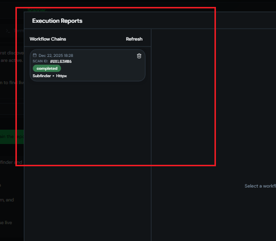

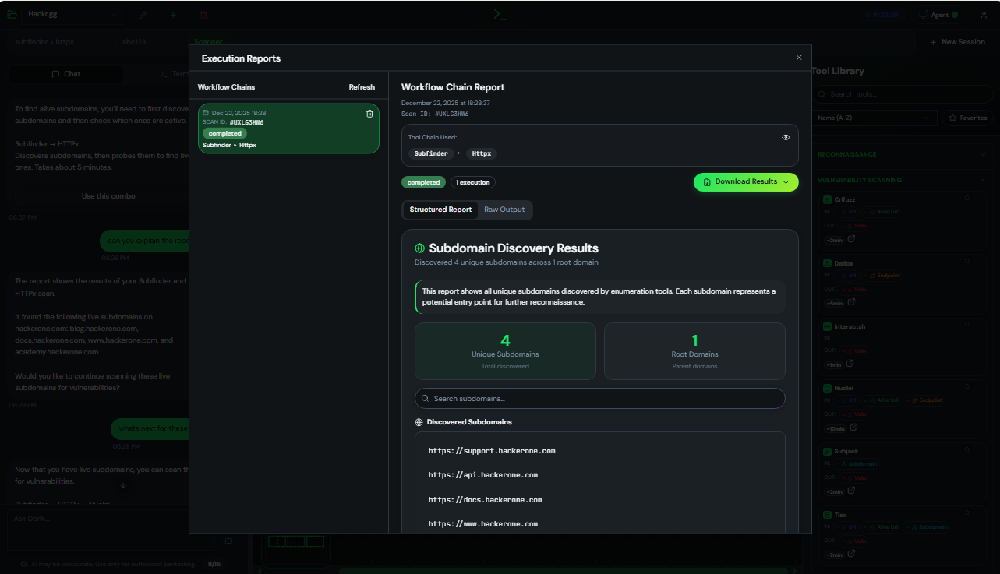

---

### AI Chat Assistant (Donk)

Not sure what to do next? The built-in AI assistant named **Donk** understands your scan context and can explain results, suggest follow-up actions, and answer security questions.

Ask things like "What should I look for on these subdomains?" or "Explain this Nuclei finding" and get contextual, actionable guidance. Donk even suggests follow-up prompts to keep your investigation moving.

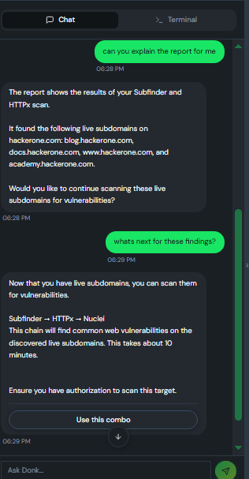

---

### Free Daily AI Credits

Every user gets **15 free AI messages per day**—no subscription required. Use them for workflow generation, result analysis, or security guidance. The credits reset daily, ensuring everyone has access to AI assistance.

A simple counter shows your remaining credits, so you always know where you stand.

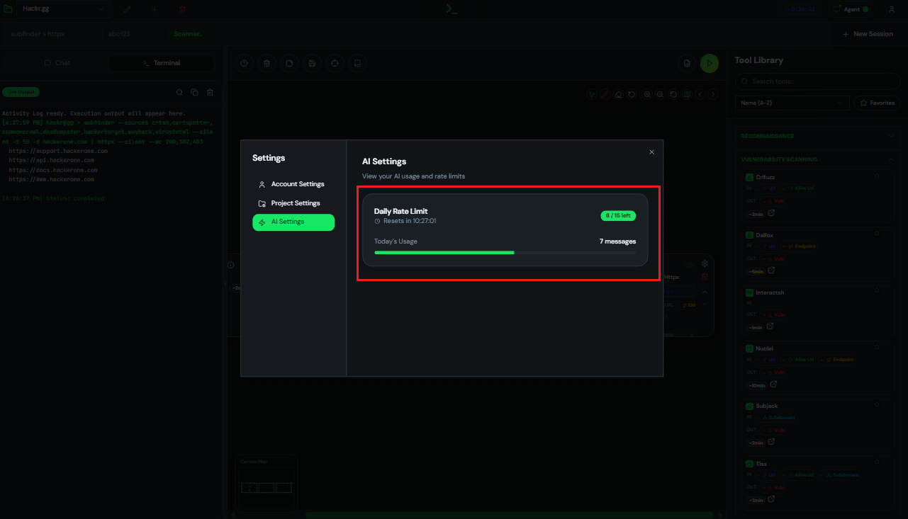

---

### Quick Fix Suggestions

Made a configuration mistake? The workflow validator catches issues before they cause problems. Incompatible tool connections, missing required fields, or logical errors trigger warnings with one-click fixes.

Click "Quick Fix" and the issue resolves automatically—saving you from debugging failed scans.

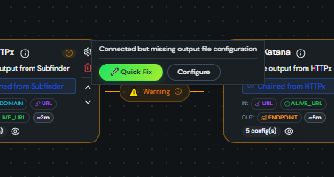

---

### In-App Bug Reporting

Found an issue? Report it without leaving the platform. The bug report dialog captures your description, severity assessment, and optionally a screenshot. Reports go directly to the development team for fast resolution.

This tight feedback loop ensures the platform evolves based on real user needs.

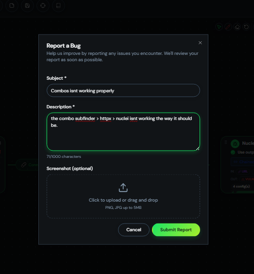

---

## 🖥️ Desktop Agent

hackr.gg executes tools on your local machine through a lightweight desktop agent. This architecture means:

- **Privacy**: Your targets and results never touch our servers
- **Performance**: Direct tool execution without network overhead
- **Flexibility**: Use your existing tool installations and configurations

### Download Agent

| Platform | Download |
|----------|----------|
| Windows | [hackrgg-agent-win.exe](agent/dist/hackrgg-agent-win.exe) |
| Linux | [hackrgg-agent-linux](agent/dist/hackrgg-agent-linux) |

### Secure Pairing

Connecting your agent is simple and secure. Generate a 6-digit pairing code in the web interface, enter it in the agent, and you're connected. The code expires quickly and can only be used once.

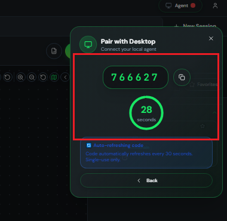

### Connection Status

The agent status indicator shows your connection state in real-time. See which device is connected, how long the session has been active, and connection health at a glance.

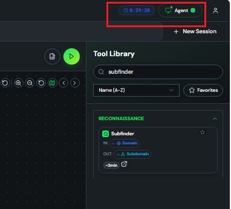

### How It Works

1. **Download** the hackr.gg agent for your platform
2. **Install** your security tools (subfinder, httpx, nuclei, etc.)
3. **Pair** with a 6-digit code from the web interface
4. **Execute** workflows from the web—tools run on your machine

The agent maintains a persistent WebSocket connection to the cloud, receiving commands and streaming results in real-time.

---

## 🔧 Tool Library

hackr.gg integrates with industry-standard security tools:

### Reconnaissance
| Tool | Purpose | Input → Output | Install |
|------|---------|----------------|---------|
| **Subfinder** | Subdomain enumeration | Domain → Subdomains | [🔗](https://github.com/projectdiscovery/subfinder) |
| **DNSx** | DNS resolution & probing | Domains → DNS Records | [🔗](https://github.com/projectdiscovery/dnsx) |
| **GAU** | URL discovery from archives | Domain → URLs | [🔗](https://github.com/lc/gau) |

### HTTP Analysis
| Tool | Purpose | Input → Output | Install |
|------|---------|----------------|---------|
| **HTTPx** | HTTP probing & fingerprinting | Domains/URLs → Live Hosts | [🔗](https://github.com/projectdiscovery/httpx) |
| **Katana** | Web crawling & spidering | URLs → Discovered URLs | [🔗](https://github.com/projectdiscovery/katana) |

### Vulnerability Scanning
| Tool | Purpose | Input → Output | Install |
|------|---------|----------------|---------|
| **Nuclei** | Template-based vuln scanning | URLs → Vulnerabilities | [🔗](https://github.com/projectdiscovery/nuclei) |
| **Dalfox** | XSS vulnerability detection | URLs → XSS Findings | [🔗](https://github.com/hahwul/dalfox) |
| **Gitleaks** | Secret & credential detection | Repos/Files → Secrets | [🔗](https://github.com/gitleaks/gitleaks) |

### Network
| Tool | Purpose | Input → Output | Install |
|------|---------|----------------|---------|
| **Naabu** | Port scanning | IPs/Domains → Open Ports | [🔗](https://github.com/projectdiscovery/naabu) |

Each tool is pre-configured with sensible defaults but fully customizable for your specific needs.

---

## 🔧 Install Security Tools

Quickly install all required Go-based security tools:

### Linux/macOS
```bash
curl -sSL https://raw.githubusercontent.com/YOUR_USERNAME/hackr.gg/main/installer/install-go-tools.sh | bash
```

### Windows
```powershell
# Download and run
Invoke-WebRequest -Uri "https://raw.githubusercontent.com/YOUR_USERNAME/hackr.gg/main/installer/install-go-tools.bat" -OutFile "install-go-tools.bat"
.\install-go-tools.bat
```

---

## 🚀 Getting Started

### Prerequisites

- Modern web browser (Chrome, Firefox, Edge)
- Windows or Linux machine for the desktop agent
- Security tools installed (subfinder, httpx, nuclei, etc.)

### Quick Start

1. **Visit** [hackr.gg](https://hackr.gg) and create an account
2. **Download** the desktop agent for your platform
3. **Install** your preferred security tools (use our installer scripts above)
4. **Pair** your agent using the 6-digit code
5. **Create** your first workflow or use AI to generate one
6. **Execute** and watch results stream in real-time

---

## 🛡️ Security & Privacy

**Your data stays yours.** hackr.gg is designed with privacy at its core:

- **Local Execution**: Tools run on YOUR machine, not our servers
- **Secure Pairing**: One-time codes with short expiration
- **Encrypted Transport**: All communication over HTTPS/WSS
- **Row-Level Security**: Database-level access controls

---

## 🤝 Contributing

Found a bug? Have a feature idea? We'd love to hear from you!

- Use the in-app bug reporter for issues
- Submit feature suggestions through the platform

---

## 📄 License

This software is proprietary. All rights reserved.

---

<p align="center">
  <strong>hackr.gg</strong> — Reconnaissance, Reimagined.
</p>

<p align="center">
  Built with ❤️ for the security community
</p>
